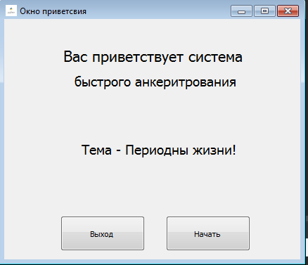
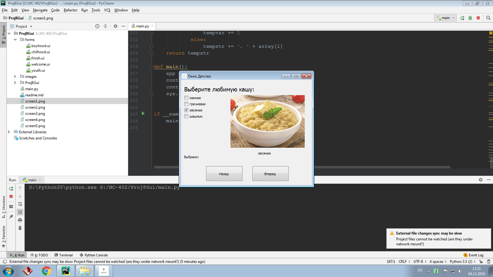
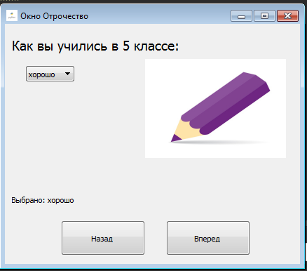
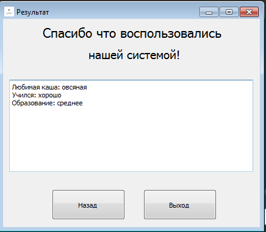

8. Создать многоокноое приложение на следующую тематику:  
	
	окно 1: Приветствие  
	окно 2:	Детство 
	окно 3: Отрочество  
	окно 4: Юность
	окно 5: Благодарность 

Окно 1:

Окно 2:

Окно 3:

Окно 4:

Окно 5:

